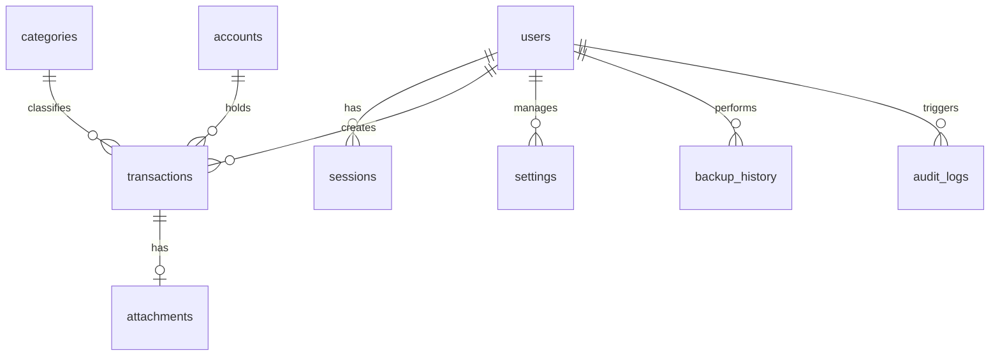

# Smart Wealth Tracker — Project Blueprint & Deployment Specification

เอกสารฉบับนี้จัดทำขึ้นเพื่อให้ AI Agent หรือนักพัฒนาท่านอื่น สามารถทำความเข้าใจระบบ โครงสร้างข้อมูล ฟังก์ชันการทำงานทั้งหมด และนำไฟล์นี้ไปสร้างโปรเจคขึ้นมาใหม่ (Replicate) หรือทำการ Deploy ขึ้น Cloudflare Pages ได้ทันทีผ่านข้อมูลนี้เพียงไฟล์เดียว

---

## 1. ภาพรวมระบบ (System Overview & Tech Stack)

**Smart Wealth Tracker** คือเว็บแอปพลิเคชันรูปแบบ Single Page Application (SPA) สำหรับบริหารและบันทึกรายรับ-รายจ่ายส่วนบุคคลแบบอัจฉริยะ (มีระบบจัดการผู้ใช้, สถิติวิเคราะห์ดุลยภาพ, การวางแผนจ่ายล่วงหน้าพร้อมแจ้งเตือน, การแนบสลิป/บิล PDF, และการรายงานผลผ่าน LINE Notify/Messaging API พร้อมทั้งการสำรองข้อมูลขึ้น Google Drive)

### Tech Stack หลัก:
*   **Frontend**: Vanilla HTML5, Vanilla JS (State Management & API Fetching), CSS Custom Variable (Design System — Slate Light Premium Theme), Chart.js (Dashboard Visualization), SheetJS / XLSX (Excel Export).
*   **Backend (Serverless)**: Cloudflare Pages Advanced worker framework (Pages Functions).
*   **Database**: Cloudflare D1 (Serverless SQL Database based on SQLite).
*   **File Storage**: Cloudflare R2 Bucket (Object Storage) สำหรับเก็บไฟล์สลิป/บิล และใช้ Cloudflare KV เป็นระบบสำรอง (Fallback) ในการเข้าถึงไฟล์.
*   **OAuth & Third Party Integrations**: 
    *   **LINE Messaging API** (Push Message): สำหรับส่งรายงานสรุปรายรับ-รายจ่ายประจำวัน/ประจำเดือน และแจ้งเตือนเมื่อ Backup ล้มเหลว.
    *   **Google Drive API** (Service Account OAuth2 JWT): สำหรับสำรองฐานข้อมูล (JSON Export) ไปยังไดรฟ์ส่วนตัวอัตโนมัติทุกวัน.

---

## 2. โครงสร้างโฟลเดอร์โครงการ (File & Directory Structure)

```
Ai รายรับรายจ่าย/
├── public/                          # Frontend Static Web Files (SPA)
│   ├── index.html                   # หน้าเว็บหลัก หน้าล็อกอิน และหน้าแอปพลิเคชัน (SPA)
│   ├── css/
│   │   └── styles.css               # ดีไซน์ระบบ Slate Light Theme, Layout, Modals, Forms
│   └── js/
│       ├── api.js                   # Client Fetch Wrapper + API Route Client Mapping
│       ├── app.js                   # Logic หลักของ UI (State Management, Dynamic Render, Event Listeners)
│       ├── charts.js                # จัดทำฟังก์ชันวาดกราฟ 3 รูปแบบด้วย Chart.js
│       └── export.js                # ประมวลผลและส่งออกรายงาน Excel (.xlsx) ด้วย SheetJS
│
├── functions/                       # Backend Cloudflare Pages Functions
│   ├── _worker.js                   # Entry Point หลักสำหรับ HTTP Pass-through และ Cron Triggers
│   └── api/
│       ├── [[path]].js              # Router และ Request Handler หลัก สำหรับ API Routes ทั้งหมด
│       └── lib/
│           ├── auth.js              # ระบบยืนยันตัวตน (PBKDF2 Password Hashing, Session Token, Rate Limit)
│           ├── db.js                # Database Access Layer ดึงและแก้ไขข้อมูลใน D1 SQL
│           ├── report.js            # สร้างเนื้อหารายงาน วิเคราะห์วิกฤตงบประมาณ และเชื่อมต่อ LINE / Google Drive
│           ├── storage.js           # จัดการไฟล์แนบ (Upload / Serve / Delete) บน R2 และ KV
│           ├── validator.js         # ตรวจสอบรูปแบบ Input Schemas ของ Transaction, Account, Category
│           ├── audit.js             # บันทึกประวัติการกระทำของผู้ใช้ (Audit Log)
│           └── backup.js            # ระบบนำเข้า/ส่งออก Backup JSON และบันทึกประวัติ Backup
│
├── migrations/                      # แฟ้มเก็บไฟล์ SQL Schema
│   ├── 001_initial_schema.sql       # โครงสร้างตาราง ดัชนี และข้อมูลเริ่มต้น
│   └── 002_seed_admin.sql           # บันทึกผู้ใช้ผู้ดูแลระบบเริ่มต้น (admin / Htmsxzs7)
│
├── wrangler.toml                    # ไฟล์กำหนดการเชื่อมโยงระบบของ Cloudflare Wrangler
└── package.json                     # กำหนด dependencies ฝั่งพัฒนาและสคริปต์รันระบบ
```

---

## 3. โครงสร้างฐานข้อมูล D1 (Database Schemas & Relationships)

ระบบใช้ Cloudflare D1 เป็นฐานข้อมูล โดยมีตารางที่เชื่อมต่อกันดังนี้:



### รายละเอียดโครงสร้างตาราง (Migrations)

#### 3.1 `migrations/001_initial_schema.sql` (โครงสร้างตารางหลัก)
```sql
-- 1. ตารางติดตามเวอร์ชัน Schema
CREATE TABLE IF NOT EXISTS schema_versions (
  version     INTEGER PRIMARY KEY,
  description TEXT    NOT NULL,
  applied_at  TEXT    NOT NULL DEFAULT (datetime('now'))
);
INSERT OR IGNORE INTO schema_versions (version, description) VALUES (1, 'Initial D1 schema');

-- 2. ตารางผู้ใช้ (Users)
CREATE TABLE IF NOT EXISTS users (
  id              TEXT    PRIMARY KEY,
  username        TEXT    NOT NULL UNIQUE,
  password_hash   TEXT    NOT NULL,
  role            TEXT    NOT NULL DEFAULT 'user',   -- 'admin' | 'user'
  is_active       INTEGER NOT NULL DEFAULT 1,
  failed_attempts INTEGER NOT NULL DEFAULT 0,
  locked_until    TEXT,                               -- ISO Datetime หรือ NULL
  last_login_at   TEXT,
  created_at      TEXT    NOT NULL DEFAULT (datetime('now')),
  updated_at      TEXT    NOT NULL DEFAULT (datetime('now')),
  deleted_at      TEXT
);

-- 3. ตารางเซสชันโทเค็น (Sessions)
CREATE TABLE IF NOT EXISTS sessions (
  id           TEXT PRIMARY KEY,
  user_id      TEXT NOT NULL REFERENCES users(id) ON DELETE CASCADE,
  token_hash   TEXT NOT NULL UNIQUE,
  user_agent   TEXT,
  ip_address   TEXT,
  expires_at   TEXT NOT NULL,
  created_at   TEXT NOT NULL DEFAULT (datetime('now')),
  last_used_at TEXT NOT NULL DEFAULT (datetime('now'))
);
CREATE INDEX IF NOT EXISTS idx_sessions_token   ON sessions(token_hash);
CREATE INDEX IF NOT EXISTS idx_sessions_user    ON sessions(user_id);
CREATE INDEX IF NOT EXISTS idx_sessions_expires ON sessions(expires_at);

-- 4. ตารางบัญชีการเงิน (Accounts)
CREATE TABLE IF NOT EXISTS accounts (
  id              TEXT    PRIMARY KEY,
  name            TEXT    NOT NULL,
  type            TEXT    NOT NULL DEFAULT 'bank',  -- 'cash' | 'bank'
  account_number  TEXT    NOT NULL DEFAULT '-',
  bank_name       TEXT    NOT NULL DEFAULT '-',
  initial_balance REAL    NOT NULL DEFAULT 0,
  sort_order      INTEGER NOT NULL DEFAULT 0,
  is_default      INTEGER NOT NULL DEFAULT 0,       -- 1 = acc-cash ( protected )
  created_at      TEXT    NOT NULL DEFAULT (datetime('now')),
  updated_at      TEXT    NOT NULL DEFAULT (datetime('now')),
  deleted_at      TEXT
);
CREATE INDEX IF NOT EXISTS idx_accounts_deleted ON accounts(deleted_at);

-- 5. ตารางหมวดหมู่ (Categories)
CREATE TABLE IF NOT EXISTS categories (
  id         TEXT    PRIMARY KEY,
  name       TEXT    NOT NULL,
  type       TEXT    NOT NULL,                      -- 'income' | 'expense'
  is_system  INTEGER NOT NULL DEFAULT 0,
  sort_order INTEGER NOT NULL DEFAULT 0,
  created_at TEXT    NOT NULL DEFAULT (datetime('now')),
  updated_at TEXT    NOT NULL DEFAULT (datetime('now')),
  deleted_at TEXT,
  UNIQUE(name, type, deleted_at)
);
CREATE INDEX IF NOT EXISTS idx_categories_type    ON categories(type);
CREATE INDEX IF NOT EXISTS idx_categories_deleted ON categories(deleted_at);

-- 6. ตารางธุรกรรมรายรับ-รายจ่าย (Transactions)
CREATE TABLE IF NOT EXISTS transactions (
  id             TEXT    PRIMARY KEY,
  date           TEXT    NOT NULL,                  -- 'YYYY-MM-DD'
  type           TEXT    NOT NULL,                  -- 'income' | 'expense' | 'future'
  category_name  TEXT    NOT NULL,                  -- ชื่อหมวดหมู่บันทึก Snapshot ไว้
  category_id    TEXT    REFERENCES categories(id) ON DELETE SET NULL,
  amount         REAL    NOT NULL DEFAULT 0,
  payment_method TEXT    NOT NULL DEFAULT 'Cash',   -- 'Cash' | 'Transfer'
  account_id     TEXT    NOT NULL REFERENCES accounts(id),
  notes          TEXT    NOT NULL DEFAULT '',
  slip_url       TEXT,                              -- URL หรือ path ของไฟล์สลิป (R2)
  status         TEXT,                              -- 'pending' | 'paid' (ใช้เฉพาะประเภท future เท่านั้น)
  created_by     TEXT    REFERENCES users(id) ON DELETE SET NULL,
  created_at     TEXT    NOT NULL DEFAULT (datetime('now')),
  updated_at     TEXT    NOT NULL DEFAULT (datetime('now')),
  deleted_at     TEXT
);
CREATE INDEX IF NOT EXISTS idx_tx_date      ON transactions(date);
CREATE INDEX IF NOT EXISTS idx_tx_account   ON transactions(account_id);
CREATE INDEX IF NOT EXISTS idx_tx_type      ON transactions(type);
CREATE INDEX IF NOT EXISTS idx_tx_category  ON transactions(category_id);
CREATE INDEX IF NOT EXISTS idx_tx_deleted   ON transactions(deleted_at);

-- 7. ตารางเก็บข้อมูลไฟล์แนบ (Attachments)
CREATE TABLE IF NOT EXISTS attachments (
  id              TEXT PRIMARY KEY,
  transaction_id  TEXT REFERENCES transactions(id) ON DELETE SET NULL,
  original_name   TEXT NOT NULL,
  stored_name     TEXT NOT NULL,
  file_url        TEXT NOT NULL,
  mime_type       TEXT,
  file_size       INTEGER,
  storage_backend TEXT NOT NULL DEFAULT 'kv',       -- 'kv' | 'r2'
  width           INTEGER,
  height          INTEGER,
  created_at      TEXT NOT NULL DEFAULT (datetime('now')),
  deleted_at      TEXT
);

-- 8. ตารางประวัติการใช้งาน (Audit Logs)
CREATE TABLE IF NOT EXISTS audit_logs (
  id          TEXT PRIMARY KEY,
  user_id     TEXT REFERENCES users(id) ON DELETE SET NULL,
  username    TEXT,
  action      TEXT NOT NULL,                        -- 'login'|'logout'|'create'|'update'|'delete'|'restore'|'backup'|'import'
  resource    TEXT NOT NULL,                        -- 'transaction'|'account'|'category'|'user'|'system'
  resource_id TEXT,
  ip_address  TEXT,
  user_agent  TEXT,
  old_data    TEXT,                                 -- ข้อมูลเดิมเก็บเป็น JSON text
  new_data    TEXT,                                 -- ข้อมูลใหม่เก็บเป็น JSON text
  created_at  TEXT NOT NULL DEFAULT (datetime('now'))
);
CREATE INDEX IF NOT EXISTS idx_audit_user    ON audit_logs(user_id);
CREATE INDEX IF NOT EXISTS idx_audit_action  ON audit_logs(action);
CREATE INDEX IF NOT EXISTS idx_audit_resource ON audit_logs(resource);
CREATE INDEX IF NOT EXISTS idx_audit_created ON audit_logs(created_at);

-- 9. ตารางการตั้งค่าระบบ (Settings)
CREATE TABLE IF NOT EXISTS settings (
  key        TEXT PRIMARY KEY,
  value      TEXT NOT NULL,
  updated_at TEXT NOT NULL DEFAULT (datetime('now')),
  updated_by TEXT REFERENCES users(id) ON DELETE SET NULL
);
INSERT OR IGNORE INTO settings (key, value) VALUES
  ('app_version',             '2.0.0'),
  ('db_schema_version',       '1'),
  ('backup_retention_days',   '30'),
  ('daily_report_enabled',    'true'),
  ('daily_backup_enabled',    'true'),
  ('line_user_id',            ''),
  ('gdrive_folder_id',        '');

-- 10. ตารางประวัติการสำรองข้อมูล (Backup History)
CREATE TABLE IF NOT EXISTS backup_history (
  id             TEXT PRIMARY KEY,
  backup_version TEXT NOT NULL DEFAULT '1',
  app_version    TEXT,
  accounts_count INTEGER,
  tx_count       INTEGER,
  categories_count INTEGER,
  storage_path   TEXT,
  file_size      INTEGER,
  checksum       TEXT,
  status         TEXT NOT NULL DEFAULT 'pending',   -- 'pending'|'success'|'failed'
  error_message  TEXT,
  created_by     TEXT REFERENCES users(id) ON DELETE SET NULL,
  created_at     TEXT NOT NULL DEFAULT (datetime('now'))
);
CREATE INDEX IF NOT EXISTS idx_backup_created ON backup_history(created_at);
CREATE INDEX IF NOT EXISTS idx_backup_status  ON backup_history(status);
```

#### 3.2 `migrations/002_seed_admin.sql` (ผู้ใช้งานเริ่มต้น)
```sql
-- รหัสผ่านผู้ใช้งานเริ่มต้น: admin / Htmsxzs7
-- เข้ารหัสผ่านรูปแบบ PBKDF2-SHA256 จำนวน Iteration 100,000 รอบ
INSERT OR IGNORE INTO users (id, username, password_hash, role, is_active, created_at, updated_at)
VALUES (
  'user-admin-001',
  'admin',
  'pbkdf2sha256:100000:8db98d5dd41e80a17a51fb955464488b:19ff3f0244cbccb968ffa09c3237d2b0f09eb2695d67c2daf7ff8ca45fde3232',
  'admin',
  1,
  '2026-07-02 08:27:42',
  '2026-07-02 08:27:42'
);

INSERT OR IGNORE INTO settings (key, value, updated_at)
VALUES
  ('backup_retention_days', '30',    '2026-07-02 08:27:42'),
  ('daily_report_enabled',  'true',  '2026-07-02 08:27:42'),
  ('timezone',              'Asia/Bangkok', '2026-07-02 08:27:42');
```

---

## 4. รายละเอียด API Endpoints (API Specification)

**Base Endpoint Path:** `/api`  
**Authentication Header:** `Authorization: Bearer <session_token>` (หรือแนบผ่าน Cookie ชื่อ `swt_session`)  
**การตอบกลับ (Response Format):** ข้อมูลจะถูกตอบกลับเป็นรูปแบบ JSON เสมอ  

### 4.1 Authentication
*   **POST `/api/login`**
    *   *สาธารณะ (ไม่ต้องใช้ Auth)*
    *   *Request Body:* `{"username": "...", "password": "..."}`
    *   *Response (200 OK):* `{"token": "JWT_LIKE_TOKEN", "username": "admin", "role": "admin", "message": "เข้าสู่ระบบสำเร็จ"}`
    *   *Cookie ตอบกลับ:* `swt_session=<token>; Path=/; HttpOnly; Secure; SameSite=Lax`
*   **POST `/api/logout`**
    *   *ต้องการ Auth*
    *   *Response (200 OK):* `{"message": "ออกจากระบบสำเร็จ"}`
*   **GET `/api/me`**
    *   *ต้องการ Auth*
    *   *Response (200 OK):* `{"id": "...", "username": "admin", "role": "admin", "is_active": 1, "last_login_at": "..."}`

### 4.2 บัญชีการเงิน (Accounts)
*   **GET `/api/accounts`**
    *   *ต้องการ Auth*
    *   *Response (200 OK):* คืนค่ารายการบัญชีพร้อมยอดคำนวณคงเหลือล่าสุดแบบ Real-time:
        ```json
        [
          {
            "id": "acc-cash",
            "name": "เงินสดหลัก",
            "type": "cash",
            "accountNumber": "-",
            "bankName": "-",
            "initialBalance": 0,
            "balance": 1520.50,
            "isDefault": true,
            "sortOrder": 0,
            "createdAt": "..."
          }
        ]
        ```
*   **POST `/api/accounts`**
    *   *ต้องการ Auth*
    *   *Request Body:* `{"name": "...", "type": "cash|bank", "accountNumber": "...", "bankName": "...", "initialBalance": 1000}`
*   **PUT `/api/accounts/:id`**
    *   *ต้องการ Auth*
*   **DELETE `/api/accounts/:id`**
    *   *ต้องการ Auth (Soft delete โดยตั้งค่า deleted_at)*

### 4.3 หมวดหมู่ (Categories)
*   **GET `/api/categories`**
*   **POST `/api/categories`**
*   **PUT `/api/categories/:id`**
*   **DELETE `/api/categories/:id`**

### 4.4 รายการธุรกรรม (Transactions)
*   **GET `/api/transactions`**
    *   *ต้องการ Auth*
    *   *Query Parameters:*
        *   `page`: เลขหน้า (default: 1)
        *   `limit`: จำนวนรายการต่อหน้า (default: 50)
        *   `accountId`: กรองเฉพาะบัญชี (ID)
        *   `type`: กรองประเภทธุรกรรม (`income` | `expense` | `future`)
        *   `startDate` & `endDate`: ช่วงเวลา (รูปแบบ YYYY-MM-DD)
        *   `keyword`: คำค้นหา (ค้นหาในรายละเอียดหรือหมวดหมู่)
    *   *Response (200 OK):*
        ```json
        {
          "data": [
            {
              "id": "tx-123",
              "date": "2026-07-09",
              "type": "expense",
              "category": "ค่าอาหาร",
              "accountId": "acc-cash",
              "amount": 120.00,
              "paymentMethod": "Cash",
              "notes": "ข้าวกระเพราไข่ดาว",
              "slipUrl": null,
              "status": null
            }
          ],
          "total": 125,
          "page": 1,
          "limit": 50,
          "pages": 3
        }
        ```
*   **POST `/api/transactions`**
    *   *ต้องการ Auth*
    *   *Request Body:*
        ```json
        {
          "date": "YYYY-MM-DD",
          "type": "income | expense | future",
          "category": "ชื่อหมวดหมู่",
          "amount": 1500,
          "paymentMethod": "Cash | Transfer",
          "accountId": "acc-123",
          "notes": "หมายเหตุเพิ่มเติม",
          "slipUrl": "/uploads/bill-123.jpg",
          "status": "pending | paid" // ใช้เมื่อ type = future เท่านั้น
        }
        ```
*   **PUT `/api/transactions/:id`**
*   **DELETE `/api/transactions/:id`** (Soft delete บันทึกเวลาที่ลบลงฟิลด์ `deleted_at`)

### 4.5 จัดการถังขยะและไฟล์แนบ
*   **GET `/api/trash`**: เรียกดูประวัติรายการบัญชีและธุรกรรมที่ถูก Soft delete
*   **POST `/api/trash/:type/:id`**: กู้คืนข้อมูล (Restore) ที่ถูกลบกลับคืนระบบ
*   **DELETE `/api/trash/:type/:id`**: ลบข้อมูลออกจากฐานข้อมูลแบบถาวร (รวมถึงลบไฟล์สลิปใน R2/KV ด้วย)
*   **POST `/api/upload`**: อัปโหลดไฟล์ภาพสลิป/บิล PDF ไปเก็บใน R2 (หรือ KV)
*   **GET `/api/uploads/:filename`**: เข้าถึงเพื่อดูไฟล์เอกสารสลิปจาก R2 หรือ KV

### 4.6 ระบบ Backup & Restore
*   **GET `/api/backup`**: ดาวน์โหลดข้อมูลระบบทั้งหมด (Accounts, Categories, Transactions) เป็นไฟล์ JSON
*   **POST `/api/restore`**: นำเข้าไฟล์สำรองข้อมูล JSON เข้าสู่ระบบเพื่อทดแทนหรือผสานข้อมูล

### 4.7 แผงควบคุมผู้ดูแลระบบ (Admin-only)
*   *เฉพาะผู้ใช้ที่มีฟิลด์ `role = 'admin'` เท่านั้นที่จะเข้าถึงกลุ่มนี้ได้*
*   **GET `/api/admin/stats`**: ดูสถิติสรุปภาพรวมทั้งหมดของระบบฐานข้อมูล D1
*   **GET `/api/admin/audit`**: ดูประวัติการกระทำและการเข้าสู่ระบบ (Audit Logs) 100 รายการย้อนหลัง
*   **GET `/api/admin/settings`** & **POST `/api/admin/settings`**: ตั้งค่าพารามิเตอร์ระบบในตาราง settings
*   **GET `/api/admin/users`** & **POST `/api/admin/users`**: เพิ่มและดูรายชื่อบัญชีผู้ใช้ระบบ
*   **GET `/api/admin/line-settings`** & **POST `/api/admin/line-settings`**: บันทึก/อ่านข้อมูลการเชื่อมต่อ Messaging API
*   **POST `/api/admin/test-line`**: ทดสอบส่งข้อความทดลองการเชื่อมต่อเข้าห้องแชท LINE กลุ่ม
*   **POST `/api/admin/send-report`**: สั่งส่ง Daily Report ไปยังกลุ่ม LINE ด้วยตัวเลือกวันที่ที่ระบุทันที
*   **POST `/api/admin/send-monthly-report`**: สั่งส่ง Monthly Report สรุปรายเดือนไปยังกลุ่ม LINE ทันที

---

## 5. การทำงานของ Backend (Functions Core Logic)

แอปพลิเคชันทำงานแบบ Serverless บน **Cloudflare Pages Functions** โดยมี Logic การทำงานหลักในโฟลเดอร์ `functions/` ดังนี้:

### 5.1 `functions/_worker.js` (Entry Point & Cron Job)
*   ทำหน้าที่เป็นตัวกรองแรกของ Request: หากเป็นการเรียกใช้ HTTP ทั่วไป จะส่งผ่านไปยังระบบ Routing ของ Pages Functions.
*   **Cron Trigger:** จัดการงานประมวลผลเบื้องหลังอัตโนมัติตามตารางเวลา:
    1.  **เวลา 17:00 UTC (00:00 น. ประเทศไทย):** เรียกฟังก์ชัน `runDailyBackup()`
        *   นำข้อมูลจากตาราง `accounts`, `categories`, และ `transactions` มาแพ็กรวมในรูปแบบ JSON.
        *   ทำการแปลงเป็น byte stream, คำนวณรหัส Checksum แบบ SHA-256.
        *   หากเปิดใช้งานคีย์ Google Service Account (`GDRIVE_SA_KEY`) จะส่งคีย์ไปแลก Access Token จาก Google OAuth และอัปโหลดไฟล์ backup ขึ้น Google Drive โฟลเดอร์ที่กำหนด.
        *   หากอัปโหลดล้มเหลว จะส่งข้อความแจ้งเตือนความผิดพลาดเข้าห้องแชทกลุ่ม LINE ทันที.
        *   บันทึกประวัติการ Backup ลงตาราง `backup_history`
    2.  **เวลา 13:00 UTC (20:00 น. ประเทศไทย):** เรียกฟังก์ชัน `runDailyReport()`
        *   ดึงรายการธุรกรรมของวันนี้ที่เกิดขึ้นและคำนวณยอดดุลยภาพ.
        *   วิเคราะห์ยอดเงินในบัญชีสะสมปัจจุบัน.
        *   **Forecasting & Budget Alert:** ดึงรายการธุรกรรมประเภท `future` ของวันพรุ่งนี้ขึ้นมาเปรียบเทียบ หากยอดรายจ่ายของวันพรุ่งนี้สูงกว่าทรัพย์สินรวมทั้งหมดในปัจจุบัน ระบบจะทำการใส่สัญลักษณ์แจ้งเตือนสีแดง `🚨🚨🚨 [เตือนภัย] รายจ่ายพรุ่งนี้เกินเงินที่มีอยู่!`
        *   **Payment Recommendation Engine:** วิเคราะห์ธุรกรรมรายรายการของวันพรุ่งนี้ เพื่อเสนอแนะว่าควรเลือกจ่ายเงินช่องทางใด โดยระบบจะจำลองการตัดเงินทีละรายการจากบัญชีที่ผูกไว้ หากบัญชีนั้นเงินไม่พอ ระบบจะสแกนหาบัญชีธนาคารอื่นที่มีเงินเพียงพอและเสนอแนะให้เปลี่ยนไปรูด/จ่ายผ่านช่องทางนั้นแทน หากไม่มีบัญชีใดพอจ่ายเดี่ยวๆ จะคำนวณว่าควรดึงยอดเงินจากบัญชีใดที่มั่งคั่งที่สุดมารวมเพื่อจ่ายรายการนั้น.
        *   ส่งข้อความรายงานที่จัดรูปแบบอย่างสวยงามผ่าน API ของ LINE ไปยังกลุ่มปลายทาง.
        *   **End-of-Month Monthly Report:** ตรวจสอบเพิ่มเติมว่าวันนี้คือวันสุดท้ายของเดือนหรือไม่ หากใช่ จะดึงยอดแยกตามหมวดหมู่รายจ่ายของทั้งเดือนมาสรุป Top 5 Categories พร้อมสัดส่วนเปอร์เซ็นต์ของรายจ่ายรวม แล้วส่งรายงานสรุปยอดประจำเดือน (Monthly Report) ซ้อนอีกหนึ่งฉบับโดยอัตโนมัติ.

### 5.2 `functions/api/lib/auth.js` (Security Layer)
*   **Password Encryption:** ใช้ฟังก์ชันก์ `crypto.subtle.deriveBits` ในการประมวลผล PBKDF2 เข้ารหัสผ่านด้วย SHA-256 ผสม Salt ขนาด 16 ไบต์ หมุนวนซ้ำ 100,000 รอบ ทำให้ปลอดภัยสูงจากการถูกโจมตีแบบ Brute Force.
*   **Constant-time Password Verification:** ตรวจสอบความถูกต้องของรหัสผ่านผู้ใช้อย่างปลอดภัยจากการเดาจังหวะเวลาตอบกลับของหน่วยความจำ (Timing Attacks) ด้วยการใช้ตัวสแกนเปรียบเทียบแบบ Constant-time.
*   **Session token management:** สุ่มสร้าง Token ขนาด 32 ไบต์แปลงเป็นเลขฐานสิบหก นำไปเก็บเป็น SHA-256 Hash ลงตาราง `sessions` กำหนดเวลาหมดอายุ 7 วัน.
*   **Brute Force Prevention & Lockout:** บันทึกประวัติล็อกอินผิดพลาด หากทำรายการล็อกอินผิดพลาดเกิน 5 ครั้งขึ้นไป บัญชีผู้ใช้นั้นจะถูกล็อกการเข้าใช้งานโดยระบุเวลาปลดล็อค `locked_until` ไปอีก 15 นาที.

### 5.3 `functions/api/lib/storage.js` (File Abstraction Layer)
*   **Validation:** ตรวจสอบประเภทไฟล์แนบจำกัดเฉพาะภาพนามสกุล `.jpg, .jpeg, .png, .webp` และไฟล์เอกสาร `.pdf` ขนาดห้ามเกิน 10MB.
*   **Abstraction:** พยายามบันทึกไฟล์สลิปลง R2 Bucket (`IMAGES` binding) เป็นลำดับแรก หากเกิดข้อผิดพลาดในการเชื่อมต่อ R2 หรือไม่ได้ผูก R2 ไว้อยู่ จะทำการสลับไปบันทึกไฟล์ลง Cloudflare KV (`KV_STORE` binding) เสมือนเป็นระบบสำรองข้อมูลไฟล์อัตโนมัติ.

---

## 6. โครงสร้างและ Logic ฝั่ง Frontend (SPA Flow)

ฝั่งหน้าบ้านถูกเขียนขึ้นด้วยรูปแบบ Vanilla JS ไร้การใช้ Framework ซับซ้อน เพื่อให้รวดเร็วและเบาที่สุด:

### 6.1 `public/js/api.js` (Client Connection)
*   สร้าง Object `API` สำหรับเรียกใช้งาน API Endpoints ทั้งหมดแบบ Async/Await.
*   มีฟังก์ชันก์หลักคือ `fetchWithAuth()` สำหรับทำหน้าที่แนบโทเค็นยืนยันตัวตน `Authorization: Bearer <token>` ไปกับ HTTP Headers โดยอัตโนมัติ และสกัดตรวจจับข้อผิดพลาด 401 (Session Expired) เพื่อบังคับให้ผู้ใช้ล็อกอินใหม่ทันที.

### 6.2 `public/js/app.js` (State & Interface Binding)
*   **State Management:** จัดการข้อมูลตัวแปรแสดงผลใน Client แบบ Single Source of Truth ผ่านตัวแปร `State`:
    ```javascript
    const State = {
      transactions: [],  // รายการธุรกรรม 500 รายการล่าสุดสำหรับแสดงผลและคำนวณกราฟ
      accounts: [],      // บัญชีเงินฝาก/เงินสดทั้งหมด
      categories: [],    // หมวดหมู่ใช้จ่ายที่สอดคล้อง
      filters: {         // สถานะตัวกรองข้อมูล
        type: 'all', category: 'all', account: 'all', search: '', dateStart: '', dateEnd: ''
      },
      pagination: { page: 1, limit: 10 } // กำหนดพารามิเตอร์การแบ่งหน้า
    };
    ```
*   **Event Handling & Routing:** แอปพลิเคชันจำลองระบบ Single Page Application (SPA) ผ่านปุ่มนำทาง Sidebar:
    *   เมื่อผู้ใช้กดเปลี่ยนเมนู ระบบจะทำการซ่อนแท็บ Section อื่น และเติม CSS class `.active` ให้แสดงผลแท็บหน้าต่างที่เลือก และดึงค่าจาก `reloadAppData()` เพื่อรีเพ้นท์ข้อมูล UI ทั้งหมด.
*   **Urgency Table Row Styling:** ในตารางธุรกรรม หากเป็นรายการล่วงหน้า (Future Transaction) ที่ยังไม่จ่ายเงิน ระบบจะแสดงสีพื้นหลังแถวตารางแยกความเร่งด่วน:
    *   *เกินกำหนดชำระ (Overdue):* แสดงเป็นสีแดงอ่อนแจ้งเตือน.
    *   *ต้องชำระในวันนี้ (Today):* แสดงเป็นสัญลักษณ์ไฮไลท์โดดเด่น.
    *   *เหลือ 1-3 วัน:* แสดงแถบสีส้มบางเบาเตือนล่วงหน้า.
    *   *เหลือ 4-7 วัน:* แสดงแถบสีเหลืองบางเบา.

### 6.3 `public/js/charts.js` (Dashboard Visualization)
*   ผูกการทำงานเข้ากับ Chart.js เพื่อวาดกราฟสถิติ 3 ตัวหลัก:
    1.  **Income vs Expenses (15-Day Bar Chart):** แสดงเปรียบเทียบยอดรับและจ่ายสะสมในกรอบเวลา 7 วันย้อนหลัง จนถึงล่วงหน้า 7 วันข้างหน้า เพื่อการเตรียมตัวทางการเงิน.
    2.  **Category Expenses (Monthly Doughnut Chart):** วิเคราะห์รายจ่ายแยกตามหมวดหมู่ในรอบเดือนปัจจุบันพร้อมทั้งคำนวณเปอร์เซ็นต์ส่วนแบ่งใน Legend ทันที.
    3.  **Net Wealth Trend (Last 30 Days Line Chart):** แสดงเส้นกราฟแนวโน้มทรัพย์สินสุทธิย้อนหลัง 30 วันแบบไล่ระดับเฉดสีใต้งานกราฟ (Rolling Balance) โดยจำลองยอดเริ่มจากยอดเงินตั้งต้นบวกหักรายรับรายจ่ายแบบสะสมรายวัน.

### 6.4 `public/js/export.js` (SheetJS Generator)
*   อ่านค่าข้อมูลล่าสุดจาก `State.transactions`, `State.accounts` และ `State.categories` มาจัดระเบียบโครงสร้างข้อมูล.
*   นำเข้าคลังสคริปต์ `SheetJS (XLSX)` เพื่อแปลงวัตถุ JSON ไปเป็น Spreadsheet.
*   ทำการจัดสร้างหน้าแท็บย่อย (Worksheets) 4 หน้า: *ภาพรวมตัวเลขสถิติ, รายการธุรกรรม, บัญชีเงินสะสม, และหมวดหมู่* พร้อมทำการเขียนขนาดความกว้างคอลัมน์อัตโนมัติ (Auto-fit Columns) และจัดบันทึกเป็นไฟล์ `.xlsx` ลงคอมพิวเตอร์ผู้ใช้โดยตรง.

---

## 7. ตัวอย่างรูปแบบไฟล์สำรองข้อมูล (JSON Backup Schema)

ไฟล์ Backup ที่ดาวน์โหลดหรืออัปโหลดเข้าสู่ระบบมีโครงสร้าง JSON มาตรฐานดังนี้ (v1.0.0):

```json
{
  "accounts": [
    {
      "id": "acc-cash",
      "name": "เงินสดสำรอง",
      "type": "cash",
      "accountNumber": "-",
      "bankName": "-",
      "initialBalance": 0,
      "balance": 1520.50
    },
    {
      "id": "acc-1715421542000",
      "name": "บัญชีกสิกรไทย",
      "type": "bank",
      "accountNumber": "012-3-45678-9",
      "bankName": "กสิกรไทย",
      "initialBalance": 10000,
      "balance": 10000
    }
  ],
  "categories": [
    {
      "id": "cat-system-food",
      "name": "อาหารและเครื่องดื่ม",
      "type": "expense",
      "isSystem": true
    },
    {
      "id": "cat-1715421555000",
      "name": "เงินเดือน",
      "type": "income",
      "isSystem": false
    }
  ],
  "transactions": [
    {
      "id": "tx-1715421600000-456",
      "date": "2026-07-09",
      "type": "expense",
      "category": "อาหารและเครื่องดื่ม",
      "amount": 75,
      "paymentMethod": "Cash",
      "accountId": "acc-cash",
      "notes": "ซื้อข้าวกลางวัน",
      "slipUrl": null
    },
    {
      "id": "tx-1715421800000-789",
      "date": "2026-07-10",
      "type": "future",
      "category": "ค่าใช้จ่ายทั่วไป",
      "amount": 2500,
      "paymentMethod": "Transfer",
      "accountId": "acc-1715421542000",
      "notes": "ค่าประกันภัยล่วงหน้า",
      "slipUrl": "/uploads/bill-bill-1715421800000.pdf",
      "status": "pending"
    }
  ],
  "backupDate": "2026-07-09T09:30:00.000Z",
  "backupVersion": 1
}
```

---

## 8. ขั้นตอนการติดตั้งและ Deploy โครงการ (Deployment & Replication)

หากต้องการนำไปสร้างใหม่หรือพัฒนาเพิ่ม ให้ดำเนินงานตามขั้นตอนดังต่อไปนี้:

### 8.1 การโคลนโปรเจคและดาวน์โหลดแพ็กเกจ
1.  นำซอร์สโค้ดใส่ในโฟลเดอร์โครงการ.
2.  ติดตั้ง Cloudflare Wrangler CLI บนเครื่องคอมพิวเตอร์:
    ```bash
    npm install -g wrangler
    ```
3.  รันคอมมานด์ติดตั้ง dependencies ที่สอดคล้องตามไฟล์ `package.json`:
    ```bash
    npm install
    ```

### 8.2 การตั้งค่าเชื่อมโยง Cloudflare (wrangler.toml)
สร้างหรืออัปเดตไฟล์ `wrangler.toml` ในไดเรกทอรีหลักของโปรเจคดังนี้:

```toml
name = "smart-wealth-tracker"
pages_build_output_dir = "public"
compatibility_date = "2026-05-29"

# 1. เชื่อมต่อฐานข้อมูล D1
[[d1_databases]]
binding       = "DB"
database_name = "smart-wealth-db"
database_id   = "ใส่คีย์-D1-DATABASE-ID-หลังรันคำสั่งสร้างฐานข้อมูล"

# 2. เชื่อมต่อ KV (Legacy / Backup Storage)
[[kv_namespaces]]
binding = "KV_STORE"
id      = "ใส่คีย์-KV-ID-หลังสร้าง-KV-Namespace"

# 3. เชื่อมต่อ R2 (Image & Bill Storage)
[[r2_buckets]]
binding     = "IMAGES"
bucket_name = "smart-wealth-tracker-images"
```

### 8.3 ขั้นตอนการเตรียมโครงสร้างฐานข้อมูล (Database Provisioning)
1.  **ล็อกอินเข้าสู่ระบบ Cloudflare ใน Terminal:**
    ```bash
    npx wrangler login
    ```
2.  **สร้างฐานข้อมูล D1 ตัวใหม่บน Cloudflare:**
    ```bash
    npx wrangler d1 create smart-wealth-db
    ```
    *นำค่า Database ID ในผลลัพธ์ Terminal ไปใส่แทนค่าในไฟล์ `wrangler.toml`*
3.  **สั่งรัน SQL Migrations เพื่อสร้าง Tables และบันทึกข้อมูลตั้งต้นขึ้นสู่ Cloudflare D1:**
    ```bash
    # รัน Migrations สร้างตารางฐานข้อมูลและดัชนี
    npx wrangler d1 execute smart-wealth-db --file=migrations/001_initial_schema.sql --remote
    
    # รันบันทึกข้อมูลผู้ใช้และระบบตั้งต้น (admin / Htmsxzs7)
    npx wrangler d1 execute smart-wealth-db --file=migrations/002_seed_admin.sql --remote
    ```
4.  **สร้างพื้นที่เก็บไฟล์ R2 Bucket บน Cloudflare:**
    ```bash
    npx wrangler r2 bucket create smart-wealth-tracker-images
    ```

### 8.4 การตั้งค่าตัวแปรสภาพแวดล้อม (Environment Secrets)
ไปที่หน้าแดชบอร์ด **Cloudflare Dashboard → Pages → smart-wealth-tracker → Settings → Environment Variables** หรือสั่งผ่านคอมมานด์ไลน์เพื่อบันทึกคีย์ลับ (Secrets):

| ตัวแปร (Variable Key) | คำอธิบายความหมาย | สถานะความจำเป็น |
|-----------------------|------------------|-----------------|
| `LINE_CHANNEL_ACCESS_TOKEN` | Channel Access Token ของ LINE Messaging API | เลือกติดตั้ง (Optional) |
| `LINE_GROUP_ID` | Group ID ของแชทกลุ่ม LINE ที่มีบอทสถิตอยู่ | เลือกติดตั้ง (Optional) |
| `GDRIVE_SA_KEY` | เนื้อหาไฟล์คีย์ JSON ของ Google Service Account (เพื่อกู้ Token อัปโหลด Drive) | เลือกติดตั้ง (Optional) |
| `GDRIVE_FOLDER_ID` | โฟลเดอร์ ID ใน Google Drive สำหรับจัดเก็บไฟล์สำรอง JSON | เลือกติดตั้ง (Optional) |

*หมายเหตุ: สำหรับโทเค็นและ Group ID ของ LINE คุณสามารถเข้าไปตั้งค่าภายหลังได้ในเว็บเพจผ่านระบบ Admin Panel (มีระบบฟอร์มคีย์เซ็ตติ้ง) โดยบอทจะไปบันทึกลงตาราง settings ใน D1 อัตโนมัติโดยไม่ต้องสั่ง Deploy ใหม่*

### 8.5 การสั่ง Deploy ระบบขึ้นโปรดักชัน
ดำเนินการรันคอมมานด์สั่ง build และส่งหน้าเว็บและโค้ดฟังก์ชัน Backend ขึ้นเซิร์ฟเวอร์ Cloudflare:
```bash
npx wrangler pages deploy public --project-name=smart-wealth-tracker
```

### 8.6 การตั้งเวลาการทำรายงานและสำรองข้อมูลอัตโนมัติ (Cron Triggers)
ระบบ Cron Pages Functions จะถูกตั้งไว้ที่ `functions/_worker.js` แล้ว แต่จำเป็นต้องระบุจุดกระตุ้นใน Cloudflare Dashboard:
1.  เปิด **Cloudflare Dashboard → Pages → smart-wealth-tracker → Settings → Functions**
2.  ไปที่หัวข้อ **Cron Triggers**
3.  กดเพิ่มเวลา 2 เงื่อนไข:
    *   `0 17 * * *` — สำหรับรันระบบ Daily Backup (เที่ยงคืนเวลาไทย / 17:00 UTC)
    *   `0 13 * * *` — สำหรับรันส่งรายงาน Daily Report เข้าแชท LINE กลุ่ม (20:00 น. เวลาไทย / 13:00 UTC)

---

## 9. ข้อมูลระบบและข้อมูลเข้าสู่ระบบเริ่มต้น
*   **หน้าเว็บหลังติดตั้ง:** เข้าใช้ผ่าน URL โครงการ Cloudflare Pages ที่ได้จากการ Deploy
*   **บัญชีผู้ดูแลระบบ (Admin) เริ่มต้น:**
    *   *Username:* `admin`
    *   *Password:* `Htmsxzs7`
*   *คำเตือน: โปรดรีบทำการเข้าสู่ระบบและเข้าไปที่บัญชีผู้ใช้ในแท็บ Admin Panel เพื่อเปลี่ยนรหัสผ่านทันทีหลังการเริ่มใช้งานจริง*
